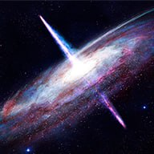

<div align="center">

# 🌌 QUASARUM - Космический патогенез мощи и трансформации



**Исследование гомеопатических принципов через призму астрофизики квазаров**

[](https://developer.mozilla.org/ru/docs/Web/HTML)
[](https://developer.mozilla.org/ru/docs/Web/CSS)
[](https://developer.mozilla.org/ru/docs/Web/JavaScript)
[](LICENSE)

[Демо](#-демо) • [Особенности](#-особенности) • [Установка](#-установка) • [Структура](#-структура-проекта) • [Разработка](#-разработка)

</div>


## 🚀 О проекте

> ✨ *"Квазары — это ярость и величие Вселенной, воплощенные в одном объекте; гравитационные чудовища, чей голод рождает сияние, видимое за миллиарды световых лет."*

**QUASARUM** — это инновационный лендинг, представляющий концепцию космического патогенеза в гомеопатии. Проект объединяет фундаментальные принципы астрофизики квазаров с гомеопатической философией, создавая уникальный цифровой опыт.

---

## 🛠 Технологии

**Фронтенд:**
- 
- 
- 

---

## 📦 Установка

Для запуска проекта локально выполните следующие шаги:

1. **Клонируйте репозиторий**
```bash
   git clone https://github.com/ZeroCreator/Quasarum.git
   cd Quasarum
```

2. **Запустите локальный сервер (рекомендуется)**

```bash
# Используя Python 3
python -m http.server 8000

# Или используя Node.js
npx http-server

# Или просто откройте index.html в браузере
```

3. **Откройте в браузере**

```text
http://localhost:8000
```

---

## 📁 Структура проекта

```text
QUASARUM/
├── 📄 index.html                 # Главная страница лендинга
├── 📖 README.md                  # Документация проекта
├── 🖼️ quasarum_banner.jpg        # Баннер проекта
├── 📁 assets/                    # Ресурсы проекта
│   ├── 🎨 css/
│   │   ├── style.css             # Основные стили
│   │   └── chapters.css          # Стили глав
│   ├── ⚡ js/
│   │   └── main.js               # JavaScript функционал
│   ├── 🖼️ images/                # Изображения и иконки
│   │   ├── quasar1.jpg - quasar12.jpg
│   │   └── telegram.png
│   └── 📚 components/
│       └── toc.html              # Компонент оглавления
├── 📁 chapters/                  # Контент глав
│   ├── chapter1.html - chapter11.html
│   ├── scientific-materials.html # Научная справка
│   ├── gallery.html              # Галерея
│   ├── references.html           # Использованные материалы
│   └── acknowledgments.html      # Благодарности
├── 📄 LICENSE                    # Проприетарная лицензия
└── 🎯 favicon.png                # Иконка сайта
```

--- 
## 🎯 Демо

🌐 Живая демонстрация: https://quasarum.vercel.app/

---

## 🔧 Разработка

📋 **Требования**

* 🌐 Современный браузер с поддержкой ES6+

* ⌨️ Текстовый редактор (VS Code, Sublime Text, etc.)

* 🖥️ Локальный веб-сервер для разработки

---

## 🛠️  Скрипты разработки

```bash
# Запуск разработки
npm run dev

# Сборка проекта
npm run build

# Деплой
npm run deploy
```

---

## 📄 Лицензия
Этот проект защищен проприетарной лицензией. Все права защищены.

**Краткая информация:**

* Автор: Shkola Olga

* Дата публикации: декабрь 2025

* Статус: Закрытая научная работа

* Контакт: shkola.olga@gmail.com

**Разрешается:**

- Ознакомление с работой в личных, некоммерческих, образовательных целях
- Цитирование фрагментов текста с обязательным указанием авторства
- Использование в научных дискуссиях и образовательном процессе

**Запрещается без предварительного письменного разрешения:**

- Коммерческое использование любых материалов работы
- Воспроизведение, копирование, модификация или распространение
- Создание производных работ на основе авторской концепции
- Интеграция в другие продукты или проекты

Полный текст лицензии доступен в файле LICENSE.

---

## 👨‍💻 Автор

Shkola Olga

💻 GitHub: https://github.com/ZeroCreator/

📧 Email: shkola.olga@gmail.com

---

<div align="center">

**QUASARUM** • Космический патогенез мощи и трансформации • 🪐

</div>